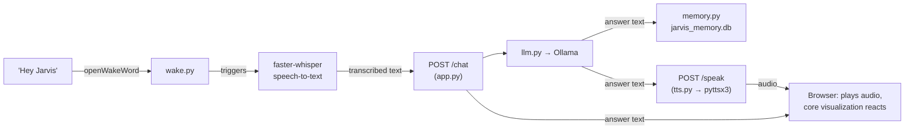

# JARVIS — Local Personal AI Assistant

A fully local, voice-first AI assistant with a cinematic, holographic
interface inspired by Iron Man's JARVIS. No cloud APIs, no paid services,
no data leaving your machine — the LLM, speech recognition, wake word
detection, and text-to-speech all run on your own hardware.

---

## Quick start

If you just want it running, in order:

1. Make sure [Ollama](https://ollama.com) is installed and running locally.
2. **Backend:**
   ```bash
   cd backend
   venv\Scripts\activate        # Windows
   # source venv/bin/activate   # macOS / Linux
   pip install -r requirements.txt
   uvicorn app:app --host 127.0.0.1 --port 8000 --reload
   ```
3. **Wake word listener** (separate terminal, still inside `backend/`):
   ```bash
   python wake.py
   ```
4. **Frontend** (separate terminal):
   ```bash
   cd frontend
   python -m http.server 5500
   ```
   Then open `http://localhost:5500` in Chrome.
5. Say **"Hey Jarvis"**, or just type in the input box and hit **Ask**.

Everything below explains what's actually happening at each of those steps.

---

## What this project is

JARVIS is split into two independent halves that talk to each other over
plain HTTP:

- **`backend/`** — a Python service that does all the "thinking": listens
  for the wake word, transcribes speech, asks a local LLM for an answer,
  and speaks the response.
- **`frontend/`** — a browser interface that shows what JARVIS is doing
  right now (idle, listening, thinking, speaking) through a live,
  audio-reactive 3D visualization, and gives you a way to type or talk to
  it directly for testing.

The frontend never talks to the LLM, the wake-word model, or the
transcription engine directly — it only ever calls two backend endpoints
(`/chat` and `/speak`). Everything AI-related happens server-side, fully
offline.

---

## How a conversation flows



In plain terms, the same flow without the diagram:

1. **Wake word** — `wake.py` runs continuously in the background using
   `openWakeWord`, listening only for "Hey Jarvis." Nothing else you say
   is processed until it hears that phrase.
2. **Speech-to-text** — once triggered, `faster-whisper` transcribes what
   you say into text.
3. **Thinking** — that text is sent to the FastAPI backend (`app.py`),
   which hands it to `llm.py`, which asks your local **Ollama** model for
   a response.
4. **Memory** — `memory.py` reads/writes `jarvis_memory.db` so JARVIS can
   keep track of conversation context (implementation details are in your
   `memory.py` — see the note at the bottom of this file).
5. **Speaking** — the answer text goes to `tts.py`, which uses `pyttsx3`
   to generate audio entirely offline, OR the frontend speaks it directly
   using the browser's built-in voice (your choice — see **Voice modes**
   below).
6. **Visualization** — the frontend receives the answer text (always) and
   the audio (if using backend voice), and the JARVIS core reacts to it
   live via the Web Audio API.

---

## Tech stack

| Layer              | Tool                          | Runs where |
|---------------------|-------------------------------|------------|
| Wake word            | openWakeWord                   | Backend (Python) |
| Speech-to-text        | faster-whisper                 | Backend (Python) |
| Language model         | Ollama (local LLM)             | Backend (Python) |
| Conversation memory      | SQLite (`jarvis_memory.db`)   | Backend (Python) |
| Text-to-speech          | pyttsx3 *or* Web Speech API   | Backend *or* Browser |
| API server                | FastAPI                     | Backend (Python) |
| Interface                   | HTML / CSS / vanilla JS    | Frontend (Browser) |
| 3D visualization               | Three.js (vendored, no CDN) | Frontend (Browser) |
| Audio-reactive visuals            | Web Audio API             | Frontend (Browser) |

---

## Project structure

```
JARVIS/
├── backend/
│   ├── app.py              FastAPI server — exposes POST /chat, POST /speak
│   ├── llm.py                Talks to your local Ollama model
│   ├── memory.py              Reads/writes conversation history
│   ├── jarvis_memory.db        SQLite database (created automatically)
│   ├── tts.py                  pyttsx3 text-to-speech
│   ├── wake.py                  "Hey Jarvis" listener (openWakeWord)
│   ├── requirements.txt
│   ├── .env                      Local config (model name, ports, etc.)
│   └── venv/                      Python virtual environment
│
└── frontend/
    ├── index.html             Page structure
    ├── style.css                All visual design (dark holographic theme)
    ├── script.js                  All frontend logic (see below)
    └── vendor/
        └── three.min.js             Three.js r128, vendored — no CDN
```

### Inside `script.js`

One file, seven clearly banner-commented sections — search for these
headers to jump around:

| Section | Namespace | What it owns |
|---|---|---|
| `STATE` | `JarvisState` | The IDLE / LISTENING / THINKING / SPEAKING state machine |
| `AUDIO` | `JarvisAudio` | Web Audio API analyser — real frequency data + a synthetic fallback |
| `SCENE` | `JarvisScene` | All Three.js: the core, rings, radial spokes, particles, the render loop |
| `BACKEND` | `JarvisBackend` | `fetch()` calls to `/chat` and `/speak` |
| `VOICE` | `JarvisVoice` | Text-to-speech — both the browser voice and the backend voice |
| `UI` | `JarvisUI` | Transcript readout, History panel, Settings panel |
| `MAIN` | *(none)* | Wires everything together: mic input, typing, the ask/answer flow |

Each section only calls another section's public functions
(`JarvisState.set(...)`, `JarvisScene.setIntensity(...)`, etc.) — never
reaches into another section's internals. That's what makes it safe to
extend one part without breaking another.

---

## Prerequisites

- **Python 3.10+**
- **[Ollama](https://ollama.com)** installed, with a model pulled, e.g.:
  ```bash
  ollama pull llama3
  ```
- A working **microphone**
- **Google Chrome** recommended for the frontend — it has the most
  complete support for the Web Speech API and Web Audio API of any
  browser. Firefox/Safari will mostly work but voice input in particular
  can behave differently.

---

## Setting up the backend

```bash
cd backend
python -m venv venv               # only needed once
venv\Scripts\activate             # Windows
# source venv/bin/activate        # macOS / Linux
pip install -r requirements.txt
```

Check your `.env` file for anything that needs setting (model name, port,
etc. — whatever `app.py` / `llm.py` reads from it) before starting the
server:

```bash
uvicorn app:app --host 127.0.0.1 --port 8000 --reload
```

You should see FastAPI's startup log and be able to open
`http://127.0.0.1:8000` in a browser (a 404 there is fine — it just means
the server is up and that route isn't defined).

**The API contract the frontend relies on:**

```
POST /chat
  → { "question": "..." }
  ← { "answer": "..." }

POST /speak
  → { "text": "..." }
  ← { "audio_base64": "...", "audio_format": "..." }
```

If you ever change these shapes in `app.py`, update `JarvisBackend` in
`script.js` (the `BACKEND` section) to match.

---

## Setting up the frontend

No install step — it's plain HTML/CSS/JS with Three.js already vendored
locally in `frontend/vendor/`.

**Option A — just open it:**
Double-click `frontend/index.html`. Works in most browsers, though some
are stricter about `fetch()` calls from a `file://` page.

**Option B — serve it locally (more reliable):**
```bash
cd frontend
python -m http.server 5500
```
Then visit `http://localhost:5500`.

Either way, the backend must already be running at `127.0.0.1:8000` — the
frontend checks that connection on load and shows the result in the
top-right corner and in Settings → System.

---

## Using JARVIS

Once both sides are running, you can talk to JARVIS two ways:

- **Type** a question in the input box and press **Ask** (or Enter).
- **Click the mic button** and speak — this uses the browser's built-in
  speech recognition (Chrome/Edge) purely for quick testing from the
  interface itself. It is *not* the wake-word pipeline; think of it as a
  manual trigger for the same LISTENING → THINKING → SPEAKING flow that
  "Hey Jarvis" would eventually kick off once the native listener is
  wired to the frontend (see **What's not connected yet**, below).

The core visualization always tells you what's happening:

| State | What it means | What you'll see |
|---|---|---|
| **IDLE** | Waiting for input | Slow rotation, gentle pulse, low particle activity |
| **LISTENING** | Capturing your speech | Brighter core, more particle/ring activity |
| **THINKING** | Waiting on the backend/LLM | Rings spin faster, a scan sweep appears |
| **SPEAKING** | Playing JARVIS's answer | Core and radial spokes react to the actual audio |

### Voice modes

Settings → Voice → **"Use local backend voice"**:

- **Off (default)** — instant, uses your browser's built-in voice
  (`SpeechSynthesis`). Zero backend calls, but the browser doesn't expose
  the raw audio, so the visualizer approximates reactivity using the
  timing of each spoken word rather than true frequency data.
- **On** — routes through `POST /speak` → `pyttsx3`, fully offline. This
  is the mode with **genuine audio-reactive visuals**, since the frontend
  taps the real audio stream with the Web Audio API.

### Other frontend features

- **History panel** — every exchange, with timestamps, in a slide-out
  panel (doesn't clutter the main view).
- **Settings panel** — voice selection/speed/volume, visualization
  intensity/particle density/animation speed, and live system status
  (microphone, backend, Ollama).
- **Dev transcript readout** — a small "You / Jarvis" panel above the
  input, meant for development. Turn it off anytime in
  Settings → Developer, or permanently by deleting that section from
  `index.html`.

---

## What's not connected yet

- **Wake word → frontend sync.** `wake.py` runs and detects "Hey Jarvis"
  independently right now; it doesn't yet tell the browser to switch to
  LISTENING automatically. The hook is ready on the frontend side —
  `JarvisState.set("LISTENING")` is a single public function — so wiring
  this up later (WebSocket, Server-Sent Events, polling, whatever you
  choose) means calling that one function from wherever your backend
  learns the wake word fired. No other frontend code needs to change.
- **Ollama model selector** and the **wake-word sensitivity slider** in
  Settings are UI-only placeholders for now — visible, styled, but not
  wired to anything, per the original design brief.

---

## Troubleshooting

**Core visualization is a black screen / buttons don't respond.**
Open DevTools (F12) → Console. This almost always means
`vendor/three.min.js` didn't load or threw an error — check the Network
tab for a failed/404 request for that file, and confirm the `vendor/`
folder sits next to `index.html` and `script.js`.

**Settings shows "Backend Offline."**
Confirm `uvicorn` is actually running and listening on `127.0.0.1:8000`.
If it's running but still shows offline, check the browser console for a
CORS error — if `app.py` doesn't already have `CORSMiddleware` enabled
for your frontend's origin, the browser will silently block the request.

**No sound when JARVIS answers.**
Browsers block audio until you've interacted with the page at least once
(click or keypress) — this happens automatically on first use, but if
you refresh and immediately expect sound, click anywhere first. Also
check Settings → Voice → "Voice output" is on, and your system volume.

**Mic button does nothing.**
Browser speech recognition (used for the manual mic-button testing path)
is Chrome/Edge-only in practice. Firefox and Safari don't support it, and
the button will show as disabled.

---

## A note on accuracy

I (Claude) wrote the frontend in this project directly, so everything
above describing `frontend/` is exact. For `backend/`, I've only ever
seen the *file names* — `app.py`, `llm.py`, `memory.py`, `tts.py`,
`wake.py`, `.env`, `requirements.txt` — not their contents, since they
haven't been shared with me. The pipeline description, the `/chat` and
`/speak` contract, and the tech stack all come directly from your
original project brief, which is solid ground — but specifics like the
exact `.env` variables, the exact `uvicorn` entrypoint, or how `wake.py`
is meant to be launched are my best reasonable inference from
conventional FastAPI/Python project layout, not confirmed from your code.
If any of that doesn't match reality, tell me and I'll correct it — or
share the backend files and I'll make this section exact.